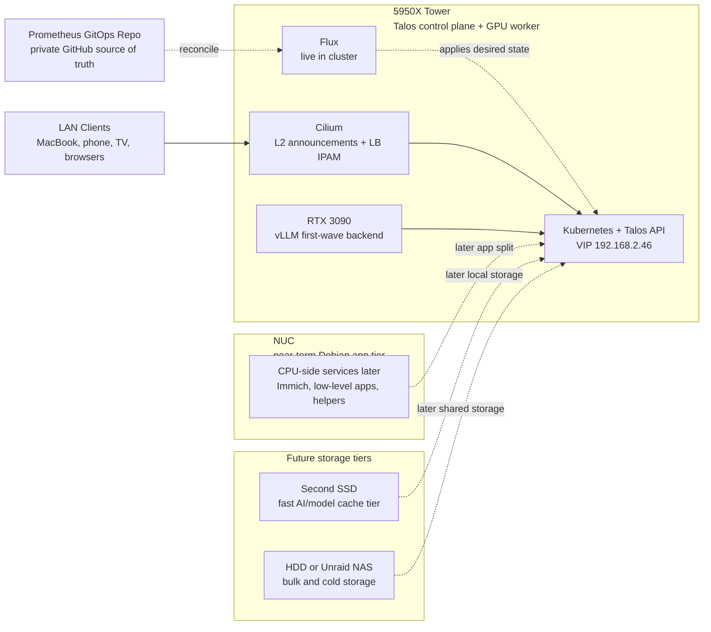

# Prometheus

> Bare-metal Kubernetes on owned hardware. Self-hosted AI inference, media automation, and full infrastructure sovereignty.

---

## Origin

This started as **MIMIR** -- a Debian box running k3s with the Arr media stack
(Sonarr, Radarr, Prowlarr, qBittorrent, Jellyfin). It worked, but it was
fragile. Mutable OS, manual SSH sessions, no GPU integration, config drift
all over the place.

The rebuild target is stricter:

- immutable OS, no SSH, no shell drift
- GPU-native local inference and agent workloads
- real GitOps and declarative networking patterns
- owned hardware, owned data, owned interfaces

Talos became the operating model because it removes the normal server-admin
escape hatches. If the platform is going to be reproducible, it has to be
expressed as API-driven state.

---

## Architecture

The live system and the future shape are both captured here. The standalone
Mermaid source for this diagram lives at
[`docs/diagrams/system-architecture.mmd`](docs/diagrams/system-architecture.mmd).

---

## Tech Stack

| Layer | Technology | Version / Detail | Status |
|-------|-----------|-----------------|--------|
| **Infrastructure OS** | Talos OS | v1.12.6 -- immutable, API-driven, no SSH | Live |
| **Orchestration** | Kubernetes | v1.35.2 | Live |
| **CNI / Networking** | Cilium | 1.18.0 -- kube-proxy replacement, L2 LoadBalancer, IPAM | Live |
| **GPU Runtime** | NVIDIA Device Plugin | v0.17.0 -- RTX 3090, 24 GB VRAM | Live |
| **GitOps** | Flux | Bootstrapped and reconciling this repo | Live |
| **Secrets** | SOPS + age | Encrypted secrets in git, cluster decryption wired | Live |
| **DNS** | AdGuard Home | Local DNS + ad blocking with test-only `home.arpa` rewrites | Live on `192.168.2.200`, separate from the router, and still not the default DHCP resolver |
| **Remote Access** | Tailscale via MIMIR | Subnet router for the current home-base LAN; currently `192.168.50.0/24` | Live |
| **AI -- Serving Backend** | vLLM | OpenAI-compatible GPU inference backend serving `Mistral-7B-Instruct-v0.3` | Live |
| **AI -- GGUF Test Backend** | llama.cpp / llama-server | Switchable Gemma 4 GGUF test backend staged for one-GPU experiments without replacing `vLLM` | Staged at `replicas: 0` |
| **AI -- Web UI** | Open WebUI | Human-facing UI that talks to the vLLM OpenAI-compatible API | Live |
| **AI -- Orchestrator** | LangGraph | Self-hosted OSS runtime for tool loops, retries, HITL resume, and thread execution | Live |
| **AI -- Execution Store** | Postgres | Durable checkpoint and application state store | Live |
| **AI -- Semantic Memory** | Mem0 | Durable facts, preferences, and project conventions | Live with Qdrant + TEI support; cross-thread write and recall validated |
| **AI -- Semantic Memory Alt** | LangMem | LangGraph-native alternative to Mem0 | Documented only |
| **AI -- Archive Sink** | Obsidian | Human-readable summaries, ADRs, and project logs exported off-tower | Live through a filesystem-markdown sink on MIMIR |
| **AI -- Parked Runtime** | Ollama | Kept in-repo as reference, not first-wave | Parked |
| **AI -- Deferred Gateway** | LiteLLM | Useful later if multiple backends appear | Deferred |
| **AI -- Deferred Memory** | Graphiti / Zep | Temporal graph memory for point-in-time queries | Deferred |
| **AI -- Deferred Agent Platform** | Letta | Alternative agent platform, not chosen here | Deferred |
| **Observability** | Prometheus + Grafana + metrics-server + DCGM exporter | In-cluster metrics, dashboards, alerting, and `kubectl top`; dashboards provisioned from Git | Live |
| **Proof of Concept App** | User-Adaptive Summarization | Summarizer app deployed from its own repo, pinned to GHCR by commit-derived image tag, and backed by private `vLLM` | Live on `192.168.2.203` with temporary Cloudflare tunnel access |
| **Media** | Arr Stack + Jellyfin | Sonarr, Radarr, Prowlarr, qBittorrent | Migration later |
| **Photos** | Immich | Existing MIMIR-side service; no Talos migration planned until a real GPU/storage reason exists | Staying on MIMIR for now |

---

## Current State

The base cluster is live, Flux is live, and the first stateful services are now
running on the Talos system SSD. `vLLM` is serving successfully, Open WebUI is
reachable remotely through Tailscale, LangGraph is live internally with
Postgres-backed execution state, and completed runs now export Markdown
artifacts to the off-tower MIMIR vault path. The first real agent workflow has
now been rehearsed live end to end: approval-gated request, Postgres-backed
execution state, Mem0 recall, and Markdown export to MIMIR. Observability is
now live too: Prometheus, Grafana, metrics-server, DCGM exporter, Flux
scrape-targets, Postgres exporter, `vLLM` metrics, and Git-provisioned
dashboards are all running in-cluster. The summarizer proof-of-concept is now
live on top of that stable base: deployed from its own repo, pinned to a
commit-derived GHCR image tag, monitored in Prometheus, and reachable through a
temporary basic-auth Cloudflare quick tunnel without exposing raw `vLLM`. DNS
cutover remains intentionally deferred while the tower is off its permanent
LAN. Windows/Talos dual-boot is treated as a real operating
constraint, the return-verification path is now host-neutral, and the MIMIR
automation path is live with a tested manual run and an enabled timer.
`llama-server` is now also staged as a switchable Gemma 4 GGUF backend, but it
stays scaled to zero because the single RTX 3090 cannot host it alongside the
stable `vLLM` deployment. The current home-base LAN is now `192.168.50.0/24`
with MIMIR at `192.168.50.171` and Prometheus at `192.168.50.197`. MIMIR is
now advertising `192.168.50.0/24` into Tailscale. One relocation issue remains:
`LangGraph` is currently blocked by an archive NFS mount that still points at
the old site (`192.168.2.40:/prometheus-vault`).

Current live proof references:

- fast operator verification: [docs/runtime-checks.md](docs/runtime-checks.md)
- bounded ASHTON departure-close proof: [docs/runbooks/ashton-deployable-check-status.md](docs/runbooks/ashton-deployable-check-status.md) and [docs/runbooks/ashton-event-boundary.md](docs/runbooks/ashton-event-boundary.md)
- bounded ATHENA edge ingress proof: [homelab-gitops/docs/runbooks/athena-edge-deployment.md](homelab-gitops/docs/runbooks/athena-edge-deployment.md)

## Release Milestones

- [x] ~~`v0.1.0`~~ Initial public/project baseline with bootstrap artifacts and
  foundational documentation.
- [x] ~~`v0.2.0`~~ Architecture pivot committed: `vLLM + LangGraph + Postgres + Obsidian`
  replaced the broader Ollama-first direction.
- [x] ~~`v0.2.1`~~ Stable `vLLM`, `Open WebUI`, and Tailscale remote-access
  checkpoint on the live cluster.
- [x] ~~`v0.3.0`~~ LangGraph live with Postgres-backed execution state, approval/resume flow,
  and restart-tested persistence.
- [x] ~~`v0.4.0`~~ Mem0 plus the external Obsidian summary/export workflow are live.
- [ ] `v0.5.0` AdGuard cutover and stable LAN naming. The first real agent workflow is already live, but DNS cutover is still deferred while the tower is off its permanent LAN.
- [x] ~~`v0.6.0`~~ Observability is live: Prometheus, Grafana, metrics-server, DCGM exporter, Git-provisioned dashboards, and the MIMIR return-check timer are all active.
- [ ] `v0.7.0` Summarizer proof-of-concept is fully documented, upgradeable, and externally testable without exposing raw `vLLM`.
- [ ] `v0.8.x+` Better storage tiers, media, Immich, and deliberate NUC role split.
- [ ] `v0.9.x+` Stable naming and router-side DNS handoff once the tower returns to its permanent LAN.
- [ ] `v1.0.0` The system reads as a complete, reproducible, serious single-environment platform.

## Live Status Block

| Area | Status | Notes |
| ---- | ------ | ----- |
| Talos + Kubernetes | Stable | Single-node control plane healthy on the dedicated 256 GB SSD |
| Cilium + LB IPs | Stable | L2 announcements and `LoadBalancer` IPs are working on the LAN |
| NVIDIA runtime | Stable | RTX 3090 allocatable and validated with a GPU test pod |
| Flux + SOPS | Stable | Repo is bootstrapped and decrypting secrets in-cluster |
| Storage | Stable | `local-path-provisioner` uses `/var/mnt/local-path-provisioner` on the OS SSD |
| Postgres | Stable | Running in-cluster on SSD-backed PVC storage |
| AdGuard Home | Stable | Serving on `http://192.168.2.200`; rewrites are configured, a real MIMIR client resolves `home.arpa` correctly when pointed at AdGuard, and any future router-side handoff only means DHCP advertises `192.168.2.200` as DNS |
| Open WebUI | Stable | Serving successfully on `http://192.168.2.201`; backend path to vLLM resolves in-cluster |
| vLLM | Stable | Serving `Mistral-7B-Instruct-v0.3` on `http://192.168.2.205:8000/v1` |
| Llama-server Gemma 4 | Staged | Internal-only Gemma 4 GGUF test backend is authored at `replicas: 0` so the one-GPU node stays honest |
| LangGraph | Degraded | Runtime image and GHCR auth are healthy, but the archive PV still points at the old NFS host `192.168.2.40`, so the relocated pod cannot mount its archive volume |
| Mem0 / Obsidian | Stable | Mem0 is live with Qdrant + TEI backing; LangGraph now exports Markdown run artifacts to the off-tower MIMIR vault path |
| Observability | Stable | Prometheus, Grafana, metrics-server, DCGM exporter, Flux scrape-targets, Postgres exporter, and `vLLM` metrics are live |
| Summarizer proof of concept | Stable | Deployed at `http://192.168.2.203`, scraping `/metrics`, and externally reachable through an auth-gated quick tunnel |
| MIMIR return automation | Stable | Host-neutral script is installed on MIMIR, the manual service run passed, and the systemd timer is enabled |
| Tailscale remote ops | Stable | MIMIR remains the subnet router and now advertises `192.168.50.0/24`; verify client-side route acceptance after subnet changes |

### Already real in the live cluster

- [x] Talos OS installed on the dedicated `LITEONIT LCS-256L9S-11` SSD only
- [x] Single-node Kubernetes control plane is healthy
- [x] Tower is currently booted on DHCP `192.168.2.49`
- [x] Kubernetes API is reachable via VIP `192.168.2.46:6443`
- [x] Cilium is live with kube-proxy replacement, L2 announcements, and `LoadBalancer` IPAM
- [x] NVIDIA kernel modules are loaded on Talos
- [x] `RuntimeClass` `nvidia` and the pinned device plugin are running
- [x] Flux is bootstrapped against this repo and reconciling the cluster
- [x] SOPS + age decryption is wired in-cluster via `flux-system/sops-age`
- [x] SSD-backed `local-path-provisioner` is live on `/var/mnt/local-path-provisioner`
- [x] Postgres is running in-cluster
- [x] AdGuard Home is running in-cluster
- [x] AdGuard rewrites exist for `k8s.home.arpa`, `adguard.home.arpa`, `openwebui.home.arpa`, and `vllm.home.arpa`
- [x] A real client on MIMIR resolves `k8s.home.arpa`, `adguard.home.arpa`, `openwebui.home.arpa`, and `vllm.home.arpa` correctly when pointed directly at AdGuard
- [x] Open WebUI is running and reachable on `192.168.2.201`
- [x] `vLLM` is serving on `192.168.2.205:8000`
- [x] `vLLM` model cache on the PVC is populated
- [x] A switchable `llama-server` Gemma 4 test backend is staged in GitOps without displacing the stable `vLLM` path
- [x] LangGraph is running internally in the `agents` namespace
- [x] LangGraph thread, run, approval, and restart persistence checks have passed
- [x] LangGraph health now reports `semantic_memory_provider: mem0` and `archive_sink: filesystem_markdown`
- [x] Tailscale remote access works through MIMIR advertising `192.168.2.0/24`
- [x] A real Mem0-backed semantic-memory path now exists in the LangGraph source
- [x] The live LangGraph deployment is pinned to the Mem0-capable immutable image tag
- [x] Qdrant plus TEI support services are live under `infra-semantic-memory`
- [x] Cross-thread semantic-memory write and recall have been validated against the live cluster
- [x] LangGraph exports Markdown run artifacts to `/srv/obsidian/prometheus-vault/Agents` on MIMIR
- [x] Prometheus, Grafana, metrics-server, and DCGM exporter are running in the `observability` namespace
- [x] Grafana is reachable on `http://192.168.2.202`
- [x] Grafana dashboards are provisioned from Git rather than created manually in the UI
- [x] `kubectl top nodes` and `kubectl top pods -A` now work
- [x] Flux, Cilium, Postgres exporter, and `vLLM` scrape surfaces are authored and live
- [x] The summarizer proof-of-concept app is deployed in its own namespace and pinned to a commit-derived GHCR image tag
- [x] The summarizer app is monitored through Prometheus and has a provisioned Grafana dashboard
- [x] The summarizer app is externally reachable through a temporary auth-gated quick tunnel without exposing raw `vLLM`

### Live but still provisional

- [ ] Router DNS is not yet cut over to AdGuard Home
- [ ] Clients are not yet pointed at AdGuard by default, so `home.arpa` naming is still in test-only mode
- [ ] The quick tunnel is intentionally temporary; a more durable external access path belongs in a later phase
- [ ] The node is still on DHCP `.49`; router reservation back to `.45` is still pending
- [x] The MIMIR systemd timer for the return-check path is installed, enabled, and tested once on the NUC

### Real in the repo and aligned with the cluster

- [x] Flux entrypoints under `homelab-gitops/clusters/talos-tower/`
- [x] GitOps definitions for Cilium, network, NVIDIA, Postgres, storage, and DNS
- [x] vLLM manifests corrected for single-GPU rollout and slow-link model downloads
- [x] `llama-server` Gemma 4 test manifests are staged separately so GGUF experiments do not mutate the stable `vLLM` backend by default
- [x] Open WebUI manifests pointed directly at vLLM
- [x] LangGraph scaffolds with explicit Postgres and future semantic-memory assumptions
- [x] Self-hosted LangGraph service source under `services/langgraph/`
- [x] `v0.4.0` memory and archive layer is live with Mem0 plus the off-tower filesystem archive sink on MIMIR
- [x] GitHub Actions builds and publishes the LangGraph runtime image to GHCR
- [x] LangGraph rollout is validated end to end against the live cluster
- [x] Ollama manifests kept as parked reference material, not the active path
- [x] Mermaid diagram sources under `docs/diagrams/`
- [x] Tailscale subnet-router runbook is documented and validated through MIMIR
- [x] AdGuard test-only rewrites and direct-query validation are documented
- [x] AdGuard real-client validation from MIMIR is documented
- [x] DNS break-glass and raw-IP fallback path are documented
- [x] Windows/Talos dual-boot shutdown and return path are documented
- [x] Observability manifests, dashboard provisioning, and validation runbooks are authored and aligned with the live cluster
- [x] MIMIR timer/service assets for the post-return check exist in-repo under `ops/mimir/`

### Not yet authored or activated

- [ ] ComfyUI manifests
- [ ] Media stack manifests
- [ ] Loki log aggregation
- [ ] Tempo distributed tracing
- [ ] Tailscale manifests, if the subnet-router path is ever replaced with an in-cluster approach

### Deferred on purpose

- [ ] Moving Immich off MIMIR without a concrete GPU or storage benefit
- [ ] MIMIR integration, migration, or endpoint cutover
- [ ] LiteLLM until there is more than one serving backend or a real cloud-fallback need
- [ ] Graphiti/Zep until point-in-time relationship queries are actually needed
- [ ] Letta because LangGraph is the chosen orchestrator
- [ ] Non-system Talos storage volumes until a dedicated SSD or NAS tier exists

### Paused for safety

- [ ] All currently installed non-system tower disks remain off-limits
- [ ] First-wave persistent state is intentionally kept on the Talos SSD only
- [ ] `vLLM` model storage stays small until a second SSD or NAS tier exists
- [ ] Frequent Windows sessions on the tower still mean expected service downtime and future observability gaps

## Growing Pains

This project is intentionally documenting the rough edges, not just the wins.
The current log of mistakes, dead ends, and fixes lives in:

- [`docs/growing-pains.md`](docs/growing-pains.md)
- [`docs/roadmap.md`](docs/roadmap.md)

Current notable examples:

- Kubernetes service-link env injection collided with `vLLM_PORT`
- single-GPU rollout strategy caused a replacement deadlock
- AdGuard's default DoH upstream choice turned out to be a poor fit for this network
- `vLLM` model startup exposed the difference between container image pulls and
  model weight downloads
- `vLLM` also exposed a second startup boundary: model weights can be present
  while KV-cache sizing is still wrong for the selected context window
- LangGraph rollout exposed the difference between a healthy pod and durable
  checkpoint persistence
- immutable LangGraph image pinning still surfaced a slow first-pull boundary on
  the Talos node before the replacement pod could take over
- the summarizer proof-of-concept initially shipped a 3 GB runtime image because
  development and evaluation dependencies were mixed into the deployable API image
- the summarizer auth proxy initially failed its own health checks because the
  probe path hit a `401 Unauthorized` by design
- ConfigMap-driven runtime changes did not restart the LangGraph pod by
  themselves
- Flux got temporarily pinned behind a failing intermediate LangGraph revision,
  so the live objects had to be converged to the already-committed repo state
  before the final `mem0` rollout could clear
- Mem0's Hugging Face embedder path still required `OPENAI_API_KEY` to exist in
  the environment even though the embedder was pointing at local TEI
- Flux and live-state drift surfaced where repo truth and runtime truth can
  briefly diverge during recovery
- the first NFS export attempt for the off-tower archive sink failed because
  MIMIR's UFW blocked NFS traffic and the initial NFSv4 export layout did not
  match the client mount path
- observability rollout surfaced a second Flux recovery edge: a bad
  `postgres-exporter` secret held the kustomization in health-check progress
  until the already-committed fixed secret was applied and the exporter was
  restarted
- the first MIMIR automation install attempt failed because the helper-host
  `talosctl` path was not portable enough; the final fix was to let the script
  fall back to a direct Talos API TCP probe when helper-host `talosctl` is not
  usable

## Why This Project Matters

This project fills a real gap between polished cloud-native theory and what it
actually takes to run a modern AI-capable platform on owned hardware:

- bare-metal Talos bring-up without managed control planes
- Cilium `LoadBalancer` networking on a normal home LAN
- NVIDIA/Talos integration on an immutable OS
- GitOps and SOPS on a real single-node cluster, not just as template files
- remote operations without exposing the cluster directly to the public internet
- local AI serving on consumer hardware with the mistakes and recovery path left visible

The point is not just to end with a nice diagram. The point is to leave behind a
system that is operable, explainable, and reusable.

## Roadmap

### Phase 1 -- Foundation *(completed)*

Bare-metal Kubernetes on Talos OS with Cilium networking and verified GPU
acceleration. Bootstrap infrastructure is documented and reproducible, and the
first GitOps layer is now authored in-repo.

### Phase 2 -- First Agent Platform *(current)*

Deploy the smallest coherent local agent stack on the RTX 3090:

- **AdGuard Home** first, so LAN DNS exists before app sprawl starts
- **vLLM** as the first and only model-serving backend
- **Open WebUI** as the human UI, pointed straight at the vLLM OpenAI-compatible API
- **Postgres** as the durable execution store for application state and checkpoints
- **LangGraph** as the orchestrator for tool loops, retries, and HITL resume
- **Obsidian** as a summary sink, now exported off-tower onto MIMIR
- **Mem0** as the semantic memory layer already running beside LangGraph

Explicit non-goals for this phase:

- No Ollama in the first activation wave
- No LiteLLM until there are multiple backends or cloud fallback
- No Graphiti/Zep temporal graph memory yet
- No Letta; LangGraph is the orchestrator

### Immediate execution queue

- [x] Finish AdGuard configuration cleanly
- [x] Add AdGuard rewrites for the first service names
- [x] Verify `Open WebUI` from the UI path, not just raw API calls
- [x] Bring up a self-hosted OSS `LangGraph` runtime
- [x] Keep `LangGraph` backed by Postgres only for `v0.3.0`
- [x] Make the first agent runtime actually usable
- [x] Add Mem0 as semantic memory
- [x] Add Obsidian summary/export workflow
- [x] Validate `home.arpa` access from a client pointed directly at AdGuard
- [x] Define and validate the first real agent workflow
- [ ] Choose the safe window for router-side DHCP/DNS handoff
- [ ] Decide whether the first default-DNS rollout happens on a single client, a secondary router segment, or the main router
- [ ] Perform the router-side DHCP/DNS handoff and validate client behavior by default
- [x] Install the committed post-return systemd timer on MIMIR once the remote link is stable enough to trust
- [x] Decide that `v0.6.0` is taggable once the MIMIR timer is installed and tested once

### After LangGraph

- [ ] Keep LangMem only as the documented alternative
- [ ] Route a real agent-facing client through LangGraph instead of using only direct operator runbooks and API smoke tests
- [ ] Define the first durable archive curation path inside the Obsidian vault

### Phase 3 -- Multi-Node Pressure Test

- Keep the NUC on Debian in the near term and use it as a low-level app/CPU host if needed
- Use that split to prove what really belongs off the GPU tower before cluster expansion
- Treat HA control-plane work as a later, deliberate step after the single-node platform proves stable under load
- Decide later whether the tower remains primary or shifts toward GPU-only duties
- Wake-on-LAN remains a later optimization, not part of the base rollout

### Phase 4 -- Full Platform

- Flux GitOps with SOPS-encrypted secrets
- Prometheus + Grafana observability stack
- MIMIR-hosted automatic post-return verification
- AdGuard Home fully cut over as the LAN DNS authority
- Arr media stack migration from MIMIR, if that still makes sense after the Talos platform settles
- Immich photo management with GPU-accelerated ML
- Second SSD for fast AI/model-cache storage
- HDD or Unraid as bulk and cold storage
- NUC role split / multi-node pressure test
- HA control-plane work later, deliberately
- CI/CD pipelines for image builds and deployment automation

---

## Project Structure

| Path | Purpose | Notes |
|------|---------|-------|
| `plan-addendum-ai-workloads-gpu-nuc.md` | Historical AI workload strategy and NUC expansion notes | Superseded by the v0.2.0 pivot docs |
| `docs/agent-memory-architecture.md` | Current AI and memory architecture source of truth | Records the `vLLM + LangGraph + Postgres + Obsidian` pivot and compares `Mem0` vs `LangMem` |
| `docs/adr/` | Architecture decision records for the next platform steps | Keeps the memory/archive path and other durable design choices explicit |
| `docs/growing-pains.md` | Troubleshooting log and lessons learned | Records the real failures, recovery path, and what those fixes changed |
| `docs/roadmap.md` | End-to-end roadmap from `v0.2.1` to `v1.0.0` | Captures the locked decisions, milestones, acceptance gates, and sequencing |
| `docs/tailscale-remote-access.md` | Remote access runbook | Explains the safe Tailscale path, why Talos-side install is deferred, and how subnet routing should work |
| `docs/diagrams/` | Mermaid source files for system, AI, request flow, and memory ERD diagrams | Mirrors the embedded diagrams in the Markdown docs |
| `docs/runtime-checks.md` | Fast operational runbook for live checks | Groups the most useful Talos, Kubernetes, Flux, endpoint, and observability commands |
| `docs/runbooks/observability-validation.md` | Observability rollout validation path | Covers Grafana reachability, dashboard provisioning, metrics API checks, and Prometheus scrape surfaces |
| `docs/runbooks/mimir-post-return-check.md` | MIMIR automation runbook | Records the repo assets, live install path, timer state, and fallback behavior on the NUC |
| `docs/runbooks/` | Operator runbooks for cutover, recovery, model changes, worker expansion, LangGraph validation, and archive export checks | First authored pass; now includes the live `v0.3.0`, `v0.4.0`, `v0.6.x` observability, and first real agent-workflow validation paths |
| `scripts/verify-after-talos-return.sh` | Post-Windows return check for the live tower | Validated from the Mac and now from MIMIR; prefers `talosctl health` but can fall back to a Talos API TCP probe on helper hosts |
| `ops/mimir/` | MIMIR-side automation assets for the post-return check | Includes the systemd service, timer, and example env file used by the live NUC automation path |
| `.github/workflows/` | CI automation for building the LangGraph runtime image | Keeps container publication out of fragile local-token workflows |
| `services/langgraph/` | Self-hosted OSS LangGraph runtime source for `v0.3.0` | Postgres-backed thread and run state with approval/resume flow; live rollout and restart persistence are validated |
| `tower-bootstrap/` | Bootstrap artifacts for the live Talos cluster | Captures what shaped the current cluster before Flux |
| `tower-bootstrap/README.md` | Bootstrap file inventory | Documents every artifact and its role |
| `homelab-gitops/` | Live GitOps tree for the current cluster state | Flux reconciles this repo; the next major runtime layers are naming cleanup and workflow polish |
| `homelab-gitops/README.md` | GitOps stage inventory | Documents what is live, what is still provisional, and what comes next |

---

## What this covers

This is not a template pretending to be a system. It is a working cluster, and
building it meant solving real platform problems:

- bootstrapping Kubernetes on bare metal without a managed control plane
- running Talos OS where everything goes through the API or not at all
- replacing kube-proxy entirely with Cilium and making `LoadBalancer` IPs show up on the LAN
- loading NVIDIA support into an immutable OS, then wiring the device plugin and `RuntimeClass`
- deciding where execution state, semantic memory, and human-readable archives should actually live
- designing a migration path from bootstrap artifacts to GitOps-managed state without tearing the platform down

---

## Why "Prometheus"

In Greek mythology, Prometheus stole fire from the gods and gave it to
humanity -- knowledge and power that was never meant to leave Olympus.

Same idea here. Instead of renting compute from cloud providers and feeding data
to corporate APIs, this runs the models locally, on owned hardware, with full
control.

<!-- repository metadata refresh: 2026-03-25 -->
