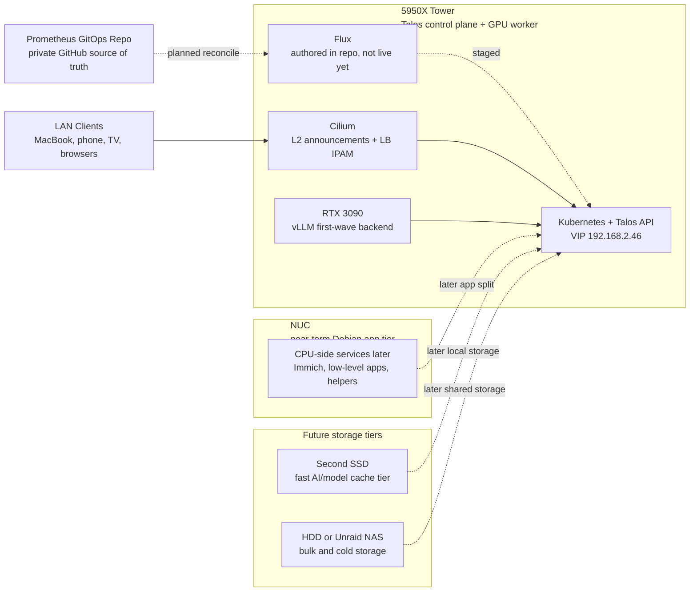

# Prometheus

> Bare-metal Kubernetes on owned hardware. Self-hosted AI inference, media automation, and full infrastructure sovereignty.

---

## Origin

This started as **MIMIR** -- a Debian box running k3s with the Arr media stack
(Sonarr, Radarr, Prowlarr, qBittorrent, Jellyfin). It worked, but it was
fragile. Mutable OS, manual SSH sessions, no GPU integration, config drift
all over the place.

The rebuild target is stricter:

- immutable OS, no SSH, no shell drift
- GPU-native local inference and agent workloads
- real GitOps and declarative networking patterns
- owned hardware, owned data, owned interfaces

Talos became the operating model because it removes the normal server-admin
escape hatches. If the platform is going to be reproducible, it has to be
expressed as API-driven state.

---

## Architecture

The live system and the future shape are both captured here. The standalone
Mermaid source for this diagram lives at
[`docs/diagrams/system-architecture.mmd`](/Users/zizo/Personal-Projects/Computers/Prometheus/docs/diagrams/system-architecture.mmd).

---

## Tech Stack

| Layer | Technology | Version / Detail | Status |
|-------|-----------|-----------------|--------|
| **Infrastructure OS** | Talos OS | v1.12.6 -- immutable, API-driven, no SSH | Live |
| **Orchestration** | Kubernetes | v1.35.2 | Live |
| **CNI / Networking** | Cilium | 1.18.0 -- kube-proxy replacement, L2 LoadBalancer, IPAM | Live |
| **GPU Runtime** | NVIDIA Device Plugin | v0.17.0 -- RTX 3090, 24 GB VRAM | Live |
| **GitOps** | Flux | Authored entrypoints and staged `Kustomization` graph | Authored, not live |
| **Secrets** | SOPS + age | Encrypted secrets in git | Planned |
| **DNS** | AdGuard Home | Local DNS + ad blocking | Authored, suspended |
| **AI -- Serving Backend** | vLLM | OpenAI-compatible GPU inference backend | Next |
| **AI -- Web UI** | Open WebUI | Human-facing chat UI pointed directly at vLLM | Authored, suspended |
| **AI -- Orchestrator** | LangGraph | Tool loops, retries, HITL resume, thread execution | Scaffolded, suspended |
| **AI -- Execution Store** | Postgres | Durable checkpoint and application state store | Scaffolded, suspended |
| **AI -- Semantic Memory** | Mem0 | Durable facts, preferences, and project conventions | Planned next layer |
| **AI -- Semantic Memory Alt** | LangMem | LangGraph-native alternative to Mem0 | Documented only |
| **AI -- Archive Sink** | Obsidian | Human-readable summaries, ADRs, project logs | Planned |
| **AI -- Parked Runtime** | Ollama | Kept in-repo as reference, not first-wave | Parked |
| **AI -- Deferred Gateway** | LiteLLM | Useful later if multiple backends appear | Deferred |
| **AI -- Deferred Memory** | Graphiti / Zep | Temporal graph memory for point-in-time queries | Deferred |
| **AI -- Deferred Agent Platform** | Letta | Alternative agent platform, not chosen here | Deferred |
| **Observability** | Prometheus + Grafana | Metrics, dashboards, alerting | Planned |
| **Media** | Arr Stack + Jellyfin | Sonarr, Radarr, Prowlarr, qBittorrent | Migration later |
| **Photos** | Immich | Self-hosted photo management with ML | Planned |

---

## Current State

The base cluster is live. The next GitOps layer is authored in the repo,
render-validated, and intentionally not active yet.

### Already real in the live cluster

- [x] Talos OS installed on the dedicated `LITEONIT LCS-256L9S-11` SSD only
- [x] Single-node Kubernetes control plane is healthy
- [x] Tower is currently booted on DHCP `192.168.2.49`
- [x] Kubernetes API is reachable via VIP `192.168.2.46:6443`
- [x] Cilium is live with kube-proxy replacement, L2 announcements, and `LoadBalancer` IPAM
- [x] A disposable `LoadBalancer` service was tested successfully on the LAN
- [x] NVIDIA kernel modules are loaded on Talos
- [x] `RuntimeClass` `nvidia` and the pinned device plugin are running
- [x] A disposable GPU test pod ran `nvidia-smi` and confirmed an RTX 3090 is allocatable

### Real in the repo, but not yet live

- [x] Flux entrypoints under `homelab-gitops/clusters/talos-tower/`
- [x] GitOps definitions for Cilium, network, NVIDIA, Postgres, storage, and DNS
- [x] Kubernetes-side local-path provisioner manifests retargeted to `/var/mnt/local-path-provisioner`
- [x] Talos-side `UserVolumeConfig` docs updated for the SSD-backed temporary storage path
- [x] AdGuard Home manifests with a fixed `LoadBalancer` IP plan
- [x] vLLM manifests with a small first-wave cache footprint on the system SSD
- [x] Open WebUI manifests retargeted from Ollama to the vLLM OpenAI-compatible endpoint
- [x] LangGraph scaffolds with explicit Postgres and future semantic-memory assumptions
- [x] Ollama manifests kept as parked reference material, not the active path
- [x] Mermaid diagram sources under `docs/diagrams/`
- [x] All of the above render cleanly with `kubectl kustomize`
- [ ] Flux is not bootstrapped against `homelab-gitops` yet

### Not yet authored or activated

- [ ] `.sops.yaml` and the `age` key material
- [ ] Mem0 manifests or secret wiring
- [ ] Obsidian summary/export workflow
- [ ] ComfyUI manifests
- [ ] Media stack manifests
- [ ] Immich manifests
- [ ] Runbooks for disaster recovery, add-worker, DNS cutover, and GPU mode switching

### Deferred on purpose

- [ ] Router DHCP reservation to move the node from `.49` back to `.45`
- [ ] MIMIR integration, migration, or endpoint cutover
- [ ] LiteLLM until there is more than one serving backend or a real cloud-fallback need
- [ ] Graphiti/Zep until point-in-time relationship queries are actually needed
- [ ] Letta because LangGraph is the chosen orchestrator

### Paused for safety

- [ ] No non-system Talos storage volumes have been applied
- [ ] All currently installed non-system tower disks remain off-limits
- [ ] The Talos SSD has about `8.11 GB` used on `/var`, so early app/runtime state can live there temporarily
- [ ] First-wave persistent state is intentionally sized small until a second SSD or NAS tier exists

---

## Roadmap

### Phase 1 -- Foundation *(current)*

Bare-metal Kubernetes on Talos OS with Cilium networking and verified GPU
acceleration. Bootstrap infrastructure is documented and reproducible, and the
first GitOps layer is now authored in-repo.

### Phase 2 -- First Agent Platform

Deploy the smallest coherent local agent stack on the RTX 3090:

- **AdGuard Home** first, so LAN DNS exists before app sprawl starts
- **vLLM** as the first and only model-serving backend
- **Open WebUI** as the human UI, pointed straight at the vLLM OpenAI-compatible API
- **Postgres** as the durable execution store for application state and checkpoints
- **LangGraph** as the orchestrator for tool loops, retries, and HITL resume
- **Obsidian** as a summary sink, not the primary machine memory store
- **Mem0** as the likely semantic memory layer once the core path is stable

Explicit non-goals for this phase:

- No Ollama in the first activation wave
- No LiteLLM until there are multiple backends or cloud fallback
- No Graphiti/Zep temporal graph memory yet
- No Letta; LangGraph is the orchestrator

### Phase 3 -- Multi-Node Pressure Test

- Keep the NUC on Debian in the near term and use it as a low-level app/CPU host if needed
- Use that split to prove what really belongs off the GPU tower before cluster expansion
- Treat HA control-plane work as a later, deliberate step after the single-node platform proves stable under load
- Decide later whether the tower remains primary or shifts toward GPU-only duties
- Wake-on-LAN remains a later optimization, not part of the base rollout

### Phase 4 -- Full Platform

- Flux GitOps with SOPS-encrypted secrets
- Prometheus + Grafana observability stack
- AdGuard Home fully cut over as the LAN DNS authority
- Arr media stack migration from MIMIR, if that still makes sense after the Talos platform settles
- Immich photo management with GPU-accelerated ML
- Second SSD for fast AI/model-cache storage
- HDD or Unraid as bulk and cold storage
- CI/CD pipelines for image builds and deployment automation

---

## Project Structure

| Path | Purpose | Notes |
|------|---------|-------|
| `plan-addendum-ai-workloads-gpu-nuc.md` | Historical AI workload strategy and NUC expansion notes | Superseded by the v0.2.0 pivot docs |
| `docs/agent-memory-architecture.md` | Current AI and memory architecture source of truth | Records the `vLLM + LangGraph + Postgres + Obsidian` pivot and compares `Mem0` vs `LangMem` |
| `docs/diagrams/` | Mermaid source files for system, AI, request flow, and memory ERD diagrams | Mirrors the embedded diagrams in the Markdown docs |
| `tower-bootstrap/` | Bootstrap artifacts for the live Talos cluster | Captures what shaped the current cluster before Flux |
| `tower-bootstrap/README.md` | Bootstrap file inventory | Documents every artifact and its role |
| `homelab-gitops/` | Authored GitOps tree for the next cluster state | Render-valid, but Flux is not bootstrapped and some layers are suspended |
| `homelab-gitops/README.md` | GitOps stage inventory | Documents what is authored, what is suspended, and what remains missing |

---

## What this covers

This is not a template pretending to be a system. It is a working cluster, and
building it meant solving real platform problems:

- bootstrapping Kubernetes on bare metal without a managed control plane
- running Talos OS where everything goes through the API or not at all
- replacing kube-proxy entirely with Cilium and making `LoadBalancer` IPs show up on the LAN
- loading NVIDIA support into an immutable OS, then wiring the device plugin and `RuntimeClass`
- deciding where execution state, semantic memory, and human-readable archives should actually live
- designing a migration path from bootstrap artifacts to GitOps-managed state without tearing the platform down

---

## Why "Prometheus"

In Greek mythology, Prometheus stole fire from the gods and gave it to
humanity -- knowledge and power that was never meant to leave Olympus.

Same idea here. Instead of renting compute from cloud providers and feeding data
to corporate APIs, this runs the models locally, on owned hardware, with full
control.

<!-- repository metadata refresh: 2026-03-25 -->
