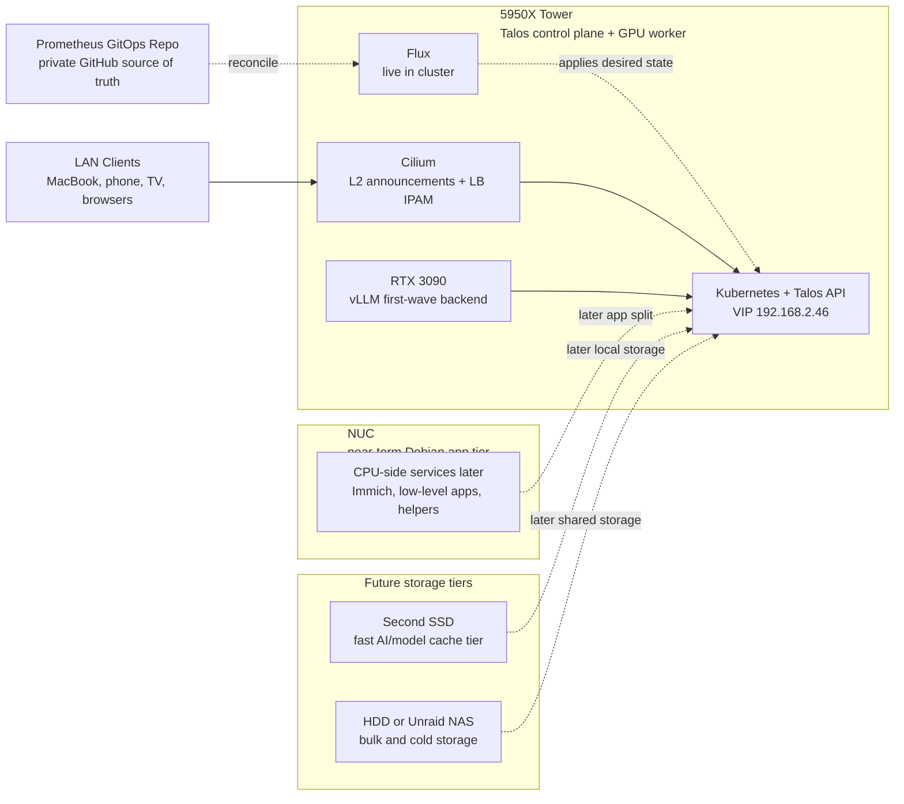

# Prometheus

> Bare-metal Kubernetes on owned hardware. Self-hosted AI inference, media automation, and full infrastructure sovereignty.

---

## Origin

This started as **MIMIR** -- a Debian box running k3s with the Arr media stack
(Sonarr, Radarr, Prowlarr, qBittorrent, Jellyfin). It worked, but it was
fragile. Mutable OS, manual SSH sessions, no GPU integration, config drift
all over the place.

The rebuild target is stricter:

- immutable OS, no SSH, no shell drift
- GPU-native local inference and agent workloads
- real GitOps and declarative networking patterns
- owned hardware, owned data, owned interfaces

Talos became the operating model because it removes the normal server-admin
escape hatches. If the platform is going to be reproducible, it has to be
expressed as API-driven state.

---

## Architecture

The live system and the future shape are both captured here. The standalone
Mermaid source for this diagram lives at
[`docs/diagrams/system-architecture.mmd`](docs/diagrams/system-architecture.mmd).

---

## Tech Stack

| Layer | Technology | Version / Detail | Status |
|-------|-----------|-----------------|--------|
| **Infrastructure OS** | Talos OS | v1.12.6 -- immutable, API-driven, no SSH | Live |
| **Orchestration** | Kubernetes | v1.35.2 | Live |
| **CNI / Networking** | Cilium | 1.18.0 -- kube-proxy replacement, L2 LoadBalancer, IPAM | Live |
| **GPU Runtime** | NVIDIA Device Plugin | v0.17.0 -- RTX 3090, 24 GB VRAM | Live |
| **GitOps** | Flux | Bootstrapped and reconciling this repo | Live |
| **Secrets** | SOPS + age | Encrypted secrets in git, cluster decryption wired | Live |
| **DNS** | AdGuard Home | Local DNS + ad blocking with test-only `home.arpa` rewrites | Live, router cutover deferred |
| **Remote Access** | Tailscale via MIMIR | Subnet router for `192.168.2.0/24` into the tailnet | Live |
| **AI -- Serving Backend** | vLLM | OpenAI-compatible GPU inference backend serving `Mistral-7B-Instruct-v0.3` | Live |
| **AI -- Web UI** | Open WebUI | Human-facing UI that talks to the vLLM OpenAI-compatible API | Live |
| **AI -- Orchestrator** | LangGraph | Self-hosted OSS runtime for tool loops, retries, HITL resume, and thread execution | Live |
| **AI -- Execution Store** | Postgres | Durable checkpoint and application state store | Live |
| **AI -- Semantic Memory** | Mem0 | Durable facts, preferences, and project conventions | Planned next layer |
| **AI -- Semantic Memory Alt** | LangMem | LangGraph-native alternative to Mem0 | Documented only |
| **AI -- Archive Sink** | Obsidian | Human-readable summaries, ADRs, project logs | Planned |
| **AI -- Parked Runtime** | Ollama | Kept in-repo as reference, not first-wave | Parked |
| **AI -- Deferred Gateway** | LiteLLM | Useful later if multiple backends appear | Deferred |
| **AI -- Deferred Memory** | Graphiti / Zep | Temporal graph memory for point-in-time queries | Deferred |
| **AI -- Deferred Agent Platform** | Letta | Alternative agent platform, not chosen here | Deferred |
| **Observability** | Prometheus + Grafana | Metrics, dashboards, alerting | Planned |
| **Media** | Arr Stack + Jellyfin | Sonarr, Radarr, Prowlarr, qBittorrent | Migration later |
| **Photos** | Immich | Self-hosted photo management with ML | Planned |

---

## Current State

The base cluster is live, Flux is live, and the first stateful services are now
running on the Talos system SSD. `vLLM` is serving successfully, Open WebUI is
reachable remotely through Tailscale, and LangGraph is now live internally with
Postgres-backed execution state. The next work has shifted from bring-up to
integration polish, DNS cutover, and the memory/archive layers.

## Release Milestones

- [x] ~~`v0.1.0`~~ Initial public/project baseline with bootstrap artifacts and
  foundational documentation.
- [x] ~~`v0.2.0`~~ Architecture pivot committed: `vLLM + LangGraph + Postgres + Obsidian`
  replaced the broader Ollama-first direction.
- [x] ~~`v0.2.1`~~ Stable `vLLM`, `Open WebUI`, and Tailscale remote-access
  checkpoint on the live cluster.
- [x] ~~`v0.3.0`~~ LangGraph live with Postgres-backed execution state, approval/resume flow,
  and restart-tested persistence.
- [ ] `v0.4.0` Mem0 plus Obsidian summary/export workflow live.
- [ ] `v0.5.0` AdGuard cutover, stable LAN naming, and first real agent workflow.
- [ ] `v0.6.0+` Observability, media, Immich, better storage tiers, and NUC role split.
- [ ] `v1.0.0` The system reads as a complete, reproducible, serious single-environment platform.

## Live Status Block

| Area | Status | Notes |
| ---- | ------ | ----- |
| Talos + Kubernetes | Stable | Single-node control plane healthy on the dedicated 256 GB SSD |
| Cilium + LB IPs | Stable | L2 announcements and `LoadBalancer` IPs are working on the LAN |
| NVIDIA runtime | Stable | RTX 3090 allocatable and validated with a GPU test pod |
| Flux + SOPS | Stable | Repo is bootstrapped and decrypting secrets in-cluster |
| Storage | Stable | `local-path-provisioner` uses `/var/mnt/local-path-provisioner` on the OS SSD |
| Postgres | Stable | Running in-cluster on SSD-backed PVC storage |
| AdGuard Home | Stable | Serving on `http://192.168.2.200`; test-only rewrites are configured and router DNS cutover is still intentionally deferred |
| Open WebUI | Stable | Serving successfully on `http://192.168.2.201`; backend path to vLLM resolves in-cluster |
| vLLM | Stable | Serving `Mistral-7B-Instruct-v0.3` on `http://192.168.2.205:8000/v1` |
| LangGraph | Stable | Internal-only runtime is live; create, run, resume, and restart-persistence checks have passed |
| Mem0 / Obsidian | Planned | Not deployed yet |
| Tailscale remote ops | Stable | MIMIR advertises `192.168.2.0/24`, so Talos/Kubernetes/services are reachable remotely |

### Already real in the live cluster

- [x] Talos OS installed on the dedicated `LITEONIT LCS-256L9S-11` SSD only
- [x] Single-node Kubernetes control plane is healthy
- [x] Tower is currently booted on DHCP `192.168.2.49`
- [x] Kubernetes API is reachable via VIP `192.168.2.46:6443`
- [x] Cilium is live with kube-proxy replacement, L2 announcements, and `LoadBalancer` IPAM
- [x] NVIDIA kernel modules are loaded on Talos
- [x] `RuntimeClass` `nvidia` and the pinned device plugin are running
- [x] Flux is bootstrapped against this repo and reconciling the cluster
- [x] SOPS + age decryption is wired in-cluster via `flux-system/sops-age`
- [x] SSD-backed `local-path-provisioner` is live on `/var/mnt/local-path-provisioner`
- [x] Postgres is running in-cluster
- [x] AdGuard Home is running in-cluster
- [x] AdGuard rewrites exist for `k8s.home.arpa`, `adguard.home.arpa`, `openwebui.home.arpa`, and `vllm.home.arpa`
- [x] Open WebUI is running and reachable on `192.168.2.201`
- [x] `vLLM` is serving on `192.168.2.205:8000`
- [x] `vLLM` model cache on the PVC is populated
- [x] LangGraph is running internally in the `agents` namespace
- [x] LangGraph thread, run, approval, and restart persistence checks have passed
- [x] Tailscale remote access works through MIMIR advertising `192.168.2.0/24`

### Live but still provisional

- [ ] Router DNS is not yet cut over to AdGuard Home
- [ ] Clients are not yet pointed at AdGuard by default, so `home.arpa` naming is still in test-only mode
- [ ] The node is still on DHCP `.49`; router reservation back to `.45` is still pending

### Real in the repo and aligned with the cluster

- [x] Flux entrypoints under `homelab-gitops/clusters/talos-tower/`
- [x] GitOps definitions for Cilium, network, NVIDIA, Postgres, storage, and DNS
- [x] vLLM manifests corrected for single-GPU rollout and slow-link model downloads
- [x] Open WebUI manifests pointed directly at vLLM
- [x] LangGraph scaffolds with explicit Postgres and future semantic-memory assumptions
- [x] Self-hosted LangGraph service source under `services/langgraph/`
- [x] `v0.4.0` semantic-memory and archive seams authored in the LangGraph service
- [x] GitHub Actions builds and publishes the LangGraph runtime image to GHCR
- [x] LangGraph rollout is validated end to end against the live cluster
- [x] Ollama manifests kept as parked reference material, not the active path
- [x] Mermaid diagram sources under `docs/diagrams/`
- [x] Tailscale subnet-router runbook is documented and validated through MIMIR
- [x] AdGuard test-only rewrites and direct-query validation are documented

### Not yet authored or activated

- [ ] Mem0 manifests or secret wiring
- [ ] Obsidian summary/export workflow
- [ ] ComfyUI manifests
- [ ] Media stack manifests
- [ ] Immich manifests
- [ ] Tailscale manifests, if the subnet-router path is ever replaced with an in-cluster approach
- [x] Runbooks for disaster recovery, add-worker, DNS cutover, releases, and model changes
- [x] LangGraph validation runbook

### Deferred on purpose

- [ ] MIMIR integration, migration, or endpoint cutover
- [ ] LiteLLM until there is more than one serving backend or a real cloud-fallback need
- [ ] Graphiti/Zep until point-in-time relationship queries are actually needed
- [ ] Letta because LangGraph is the chosen orchestrator
- [ ] Non-system Talos storage volumes until a dedicated SSD or NAS tier exists

### Paused for safety

- [ ] All currently installed non-system tower disks remain off-limits
- [ ] First-wave persistent state is intentionally kept on the Talos SSD only
- [ ] `vLLM` model storage stays small until a second SSD or NAS tier exists

## Growing Pains

This project is intentionally documenting the rough edges, not just the wins.
The current log of mistakes, dead ends, and fixes lives in:

- [`docs/growing-pains.md`](docs/growing-pains.md)
- [`docs/roadmap.md`](docs/roadmap.md)

Current notable examples:

- Kubernetes service-link env injection collided with `vLLM_PORT`
- single-GPU rollout strategy caused a replacement deadlock
- AdGuard's default DoH upstream choice turned out to be a poor fit for this network
- `vLLM` model startup exposed the difference between container image pulls and
  model weight downloads
- `vLLM` also exposed a second startup boundary: model weights can be present
  while KV-cache sizing is still wrong for the selected context window
- LangGraph rollout exposed the difference between a healthy pod and durable
  checkpoint persistence
- Flux and live-state drift surfaced where repo truth and runtime truth can
  briefly diverge during recovery

## Why This Project Matters

This project fills a real gap between polished cloud-native theory and what it
actually takes to run a modern AI-capable platform on owned hardware:

- bare-metal Talos bring-up without managed control planes
- Cilium `LoadBalancer` networking on a normal home LAN
- NVIDIA/Talos integration on an immutable OS
- GitOps and SOPS on a real single-node cluster, not just as template files
- remote operations without exposing the cluster directly to the public internet
- local AI serving on consumer hardware with the mistakes and recovery path left visible

The point is not just to end with a nice diagram. The point is to leave behind a
system that is operable, explainable, and reusable.

## Roadmap

### Phase 1 -- Foundation *(completed)*

Bare-metal Kubernetes on Talos OS with Cilium networking and verified GPU
acceleration. Bootstrap infrastructure is documented and reproducible, and the
first GitOps layer is now authored in-repo.

### Phase 2 -- First Agent Platform *(current)*

Deploy the smallest coherent local agent stack on the RTX 3090:

- **AdGuard Home** first, so LAN DNS exists before app sprawl starts
- **vLLM** as the first and only model-serving backend
- **Open WebUI** as the human UI, pointed straight at the vLLM OpenAI-compatible API
- **Postgres** as the durable execution store for application state and checkpoints
- **LangGraph** as the orchestrator for tool loops, retries, and HITL resume
- **Obsidian** as a summary sink, not the primary machine memory store
- **Mem0** as the likely semantic memory layer once the core path is stable

Explicit non-goals for this phase:

- No Ollama in the first activation wave
- No LiteLLM until there are multiple backends or cloud fallback
- No Graphiti/Zep temporal graph memory yet
- No Letta; LangGraph is the orchestrator

### Immediate execution queue

- [x] Finish AdGuard configuration cleanly
- [x] Add AdGuard rewrites for the first service names
- [x] Verify `Open WebUI` from the UI path, not just raw API calls
- [x] Bring up a self-hosted OSS `LangGraph` runtime
- [x] Keep `LangGraph` backed by Postgres only for `v0.3.0`
- [x] Make the first agent runtime actually usable
- [ ] Validate `home.arpa` access from a client pointed directly at AdGuard
- [ ] Choose the safe window for router DNS cutover

### After LangGraph

- [ ] Add Obsidian summary/export workflow
- [ ] Add Mem0 as semantic memory
- [ ] Keep LangMem only as the documented alternative

### Phase 3 -- Multi-Node Pressure Test

- Keep the NUC on Debian in the near term and use it as a low-level app/CPU host if needed
- Use that split to prove what really belongs off the GPU tower before cluster expansion
- Treat HA control-plane work as a later, deliberate step after the single-node platform proves stable under load
- Decide later whether the tower remains primary or shifts toward GPU-only duties
- Wake-on-LAN remains a later optimization, not part of the base rollout

### Phase 4 -- Full Platform

- Flux GitOps with SOPS-encrypted secrets
- Prometheus + Grafana observability stack
- AdGuard Home fully cut over as the LAN DNS authority
- Arr media stack migration from MIMIR, if that still makes sense after the Talos platform settles
- Immich photo management with GPU-accelerated ML
- Second SSD for fast AI/model-cache storage
- HDD or Unraid as bulk and cold storage
- NUC role split / multi-node pressure test
- HA control-plane work later, deliberately
- CI/CD pipelines for image builds and deployment automation

---

## Project Structure

| Path | Purpose | Notes |
|------|---------|-------|
| `plan-addendum-ai-workloads-gpu-nuc.md` | Historical AI workload strategy and NUC expansion notes | Superseded by the v0.2.0 pivot docs |
| `docs/agent-memory-architecture.md` | Current AI and memory architecture source of truth | Records the `vLLM + LangGraph + Postgres + Obsidian` pivot and compares `Mem0` vs `LangMem` |
| `docs/adr/` | Architecture decision records for the next platform steps | Keeps the memory/archive path and other durable design choices explicit |
| `docs/growing-pains.md` | Troubleshooting log and lessons learned | Records the real failures, recovery path, and what those fixes changed |
| `docs/roadmap.md` | End-to-end roadmap from `v0.2.1` to `v1.0.0` | Captures the locked decisions, milestones, acceptance gates, and sequencing |
| `docs/tailscale-remote-access.md` | Remote access runbook | Explains the safe Tailscale path, why Talos-side install is deferred, and how subnet routing should work |
| `docs/diagrams/` | Mermaid source files for system, AI, request flow, and memory ERD diagrams | Mirrors the embedded diagrams in the Markdown docs |
| `docs/runtime-checks.md` | Fast operational runbook for live checks | Groups the most useful Talos, Kubernetes, Flux, and endpoint commands |
| `docs/runbooks/` | Operator runbooks for cutover, recovery, model changes, worker expansion, and LangGraph validation | First authored pass; now includes the live `v0.3.0` validation path |
| `.github/workflows/` | CI automation for building the LangGraph runtime image | Keeps container publication out of fragile local-token workflows |
| `services/langgraph/` | Self-hosted OSS LangGraph runtime source for `v0.3.0` | Postgres-backed thread and run state with approval/resume flow; live rollout and restart persistence are validated |
| `tower-bootstrap/` | Bootstrap artifacts for the live Talos cluster | Captures what shaped the current cluster before Flux |
| `tower-bootstrap/README.md` | Bootstrap file inventory | Documents every artifact and its role |
| `homelab-gitops/` | Live GitOps tree for the current cluster state | Flux reconciles this repo; the next major runtime layers are naming cleanup and memory/archive work |
| `homelab-gitops/README.md` | GitOps stage inventory | Documents what is live, what is still provisional, and what comes next |

---

## What this covers

This is not a template pretending to be a system. It is a working cluster, and
building it meant solving real platform problems:

- bootstrapping Kubernetes on bare metal without a managed control plane
- running Talos OS where everything goes through the API or not at all
- replacing kube-proxy entirely with Cilium and making `LoadBalancer` IPs show up on the LAN
- loading NVIDIA support into an immutable OS, then wiring the device plugin and `RuntimeClass`
- deciding where execution state, semantic memory, and human-readable archives should actually live
- designing a migration path from bootstrap artifacts to GitOps-managed state without tearing the platform down

---

## Why "Prometheus"

In Greek mythology, Prometheus stole fire from the gods and gave it to
humanity -- knowledge and power that was never meant to leave Olympus.

Same idea here. Instead of renting compute from cloud providers and feeding data
to corporate APIs, this runs the models locally, on owned hardware, with full
control.

<!-- repository metadata refresh: 2026-03-25 -->
