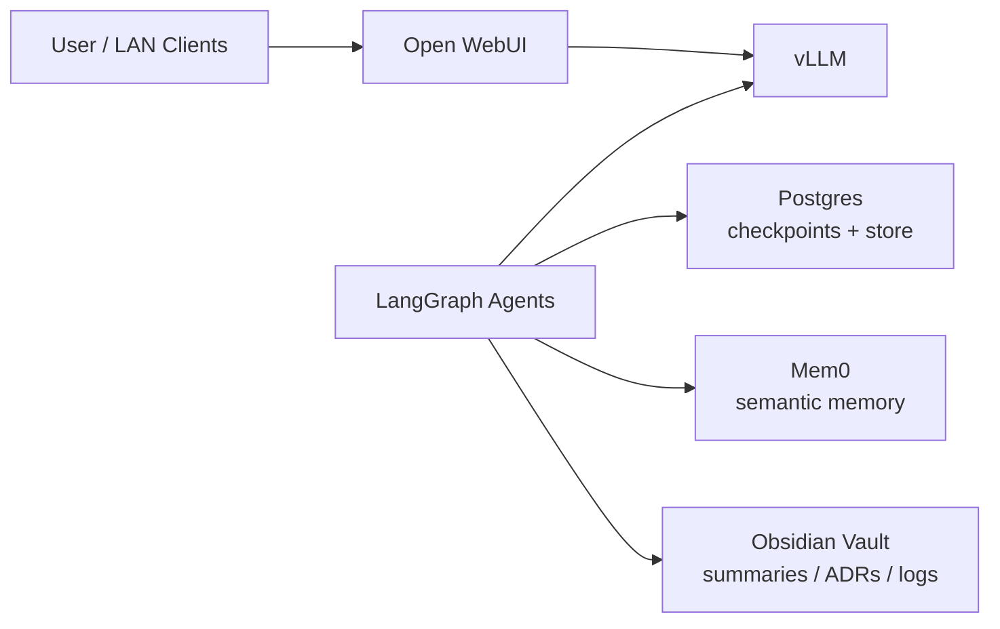

# Agent And Memory Architecture

Last updated: 2026-03-25 (America/Toronto)

## Why this document exists

The repo originally leaned toward a broader local AI stack with `Ollama`,
`Open WebUI`, `vLLM`, and later `ComfyUI`. That was useful for exploration,
but it is not the cleanest first platform for agent orchestration on a single
RTX 3090.

The current direction is narrower and more coherent:

- one orchestrator
- one serving backend
- one semantic memory system
- one archive sink
- clean interfaces between each layer

## Current pivot

The current preferred stack is:

- `vLLM` as the only model-serving backend
- `LangGraph` as the orchestrator
- `Postgres` as the durable execution store
- `Obsidian` as the human-readable archive sink
- `Mem0` as the likely semantic memory layer

The following are explicitly not part of the first activation wave:

- `Ollama`
- `LiteLLM`
- `Graphiti` / `Zep`
- `Letta`

## Where the project paused before this pivot

Before the architecture pivot, the project stopped at the storage safety gate.

What was already real:

- Talos installed on the dedicated `256 GB` SSD
- Kubernetes control plane healthy
- Cilium, L2 announcements, and `LoadBalancer` IPAM live
- NVIDIA runtime and device plugin live
- GPU scheduling validated on the RTX 3090

What had been authored but not activated:

- Flux entrypoints
- staged GitOps manifests for Cilium, network, NVIDIA, storage, DNS, and AI

What blocked the next step:

- the current non-system SSD and NVMe targets are in use elsewhere
- no safe local app-storage disk is available yet
- no Talos `UserVolumeConfig` was applied

What remains true right now:

- the Talos system SSD still has significant headroom for early app/runtime use
- the cluster can proceed with small-footprint services before dedicated app
  storage is solved

## Revised target architecture

## The three memory layers

### 1. Execution memory

Purpose:

- current thread state
- retries
- human-in-the-loop resume
- checkpoint history

This belongs to:

- `LangGraph` persistence
- backed by `Postgres`

This is the authoritative machine state for workflow execution.

### 2. Semantic memory

Purpose:

- user preferences
- durable facts
- project conventions
- stable policies

This belongs to:

- `Mem0` or `LangMem`

This is not about replaying every message. It is about extracting the durable
facts that should survive across sessions.

### 3. Human-readable archive

Purpose:

- summaries
- ADRs
- project logs
- curated knowledge

This belongs to:

- `Obsidian`

Obsidian is for humans first. It should hold readable artifacts the agent can
also reference later, but it should not be the primary machine memory store.

## Mem0 vs LangMem

### Recommendation

If the project stays centered on `LangGraph`, either choice is defensible.
Right now, `Mem0` is the more likely pick for this repo because it is a clearer
standalone semantic-memory layer.

### Mem0

Strengths:

- purpose-built for extracting and updating durable memories
- good fit for preferences, project rules, and stable user facts
- cleaner if you want semantic memory to stay somewhat decoupled from the
  LangGraph runtime itself

Tradeoffs:

- another service / integration surface
- less native to the LangGraph ecosystem than LangMem

Use Mem0 if:

- you want one dedicated semantic-memory system
- you expect that memory layer to survive even if the agent runtime evolves

### LangMem

Strengths:

- native fit with LangGraph / LangChain conventions
- coherent if you want the whole stack to stay in one ecosystem
- lower conceptual impedance if LangGraph remains the long-term orchestrator

Tradeoffs:

- more coupled to the LangGraph/LangChain stack
- less attractive if you want semantic memory to remain reusable outside that
  ecosystem

Use LangMem if:

- you are committed to LangGraph as the long-term agent runtime
- you value native integration over independence

### Practical decision

For this repo:

- `Mem0` is the likely first choice
- `LangMem` remains the main alternative, not a second layer to run alongside it

Do not run both first. Pick one semantic memory system.

## What temporal relationship memory means

Temporal relationship memory is not just “remembering facts.” It is remembering
how relationships change over time.

Example:

- January: “The NUC is an external Debian box.”
- March: “The NUC is still external, but planned as a future app host.”
- Later: “The NUC joined the cluster as a worker.”

A temporal graph memory system can answer questions like:

- what did the homelab topology look like in January?
- when did the NUC stop being external-only?
- which storage strategy was in effect before Unraid existed?

That is different from ordinary semantic memory, which would just try to store
the latest stable facts.

This is why `Graphiti` / `Zep` is interesting. It is designed for changing
relationships, historical context, and point-in-time queries. It is also a more
complex system than this repo needs right now.

## Explicit not-now decisions

### LiteLLM

Not now.

Reason:

- `vLLM` already exposes an OpenAI-compatible API
- there is only one serving backend today
- there is no immediate cloud fallback requirement

Add LiteLLM later if:

- there are multiple serving backends
- a stable gateway becomes useful
- cloud fallback is introduced

### Graphiti / Zep

Not now.

Reason:

- temporal relationship memory is interesting but not yet required
- it would add another stateful subsystem before the core platform is stable

Add later if:

- historical topology / policy queries become a real need
- semantic memory alone stops being enough

### Letta

Not now.

Reason:

- `LangGraph` is the chosen orchestrator
- Letta is closer to an alternative agent platform than a small add-on

## Revised rollout order

1. Solve the immediate storage decision for safe early app state.
2. Activate `AdGuard Home`.
3. Keep `Open WebUI`, but point the architecture toward an OpenAI-compatible
   backend rather than Ollama-first assumptions.
4. Author and deploy `vLLM`.
5. Author and deploy `Postgres`.
6. Author and deploy `LangGraph`.
7. Add Obsidian summary/export workflow.
8. Add `Mem0` as the semantic memory layer.
9. Revisit `LiteLLM`, `Graphiti`, or `Letta` only if the single-backend,
   single-memory approach stops being sufficient.
