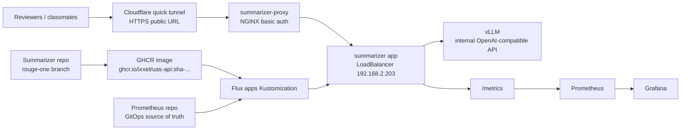

# Summarizer Validation Runbook

Last updated: 2026-03-31 (America/Toronto)

## Purpose

Validate the summarizer proof-of-concept as a platform workload, not as a raw
app-only demo. The stable platform pieces stay private; reviewers only touch the
summarizer surface.

Interaction structure:



Standalone Mermaid source:
- [summarizer-platform-flow.mmd](../diagrams/summarizer-platform-flow.mmd)

## Internal checks

```bash
kubectl --kubeconfig /Users/zizo/Personal-Projects/Computers/Talos/tower-bootstrap/kubeconfig -n summarizer get deploy,svc,pods -o wide
curl http://192.168.2.203/api/health
curl http://192.168.2.203/metrics | sed -n '1,20p'
```

Expected:
- `summarizer`, `summarizer-proxy`, and `summarizer-tunnel` are `1/1`
- `/api/health` returns `{"status":"ok"}`
- `/metrics` returns Prometheus-format output

## Prometheus target check

```bash
kubectl --kubeconfig /Users/zizo/Personal-Projects/Computers/Talos/tower-bootstrap/kubeconfig -n observability port-forward svc/kube-prometheus-stack-prometheus 19090:9090
curl 'http://127.0.0.1:19090/api/v1/query?query=up%7Bnamespace%3D%22summarizer%22%7D'
```

Expected:
- the `summarizer` target returns `up == 1`

## External quick-tunnel check

Get the current URL from the live tunnel logs:

```bash
kubectl --kubeconfig /Users/zizo/Personal-Projects/Computers/Talos/tower-bootstrap/kubeconfig -n summarizer logs deploy/summarizer-tunnel --tail=80 | rg 'https://.*trycloudflare.com'
```

Test with the reviewer credentials you communicate out of band:

```bash
curl -u '<user>:<password>' https://<trycloudflare-url>/api/health
```

Expected:
- authenticated request returns `{"status":"ok"}`
- unauthenticated request returns `401 Unauthorized`

## Important constraints

- the quick tunnel is temporary and its URL can change if the pod restarts
- raw `vllm` stays private and is never the reviewer-facing endpoint
- the auth credentials are intentionally not committed to the runbook; rotate and
  communicate them separately
