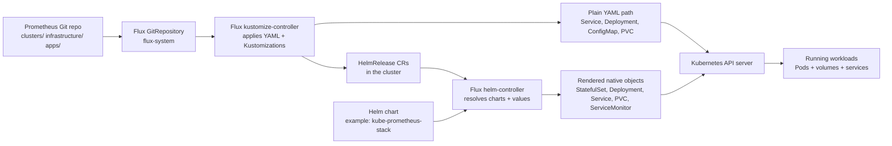
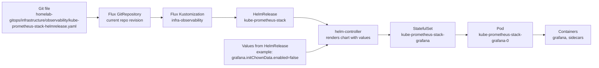
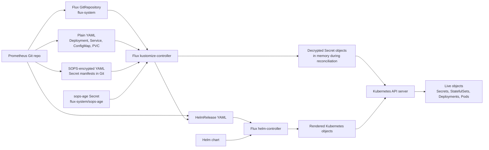

# Homelab GitOps

Last updated: 2026-03-27 (America/Toronto)

## Status

This directory is no longer a skeleton. It now drives the live cluster via Flux.
The first stateful services are healthy, `vLLM` is serving successfully, the
LangGraph runtime is live, and the observability slice is now running too. The
next meaningful steps are naming cleanup, router cutover preparation, and
turning the now-defined first real agent workflow into the default named path
rather than an operator-only validation path.

Authored and render-valid now:

- `clusters/talos-tower/infrastructure.yaml`
- `clusters/talos-tower/apps.yaml`
- `infrastructure/cilium/`
- `infrastructure/network/`
- `infrastructure/nvidia/`
- `infrastructure/storage/` for Kubernetes-side local-path provisioning
- `infrastructure/postgres/` for the first execution store
- `infrastructure/semantic-memory/` for staged `Qdrant + TEI` support services
- `infrastructure/dns/` for AdGuard Home
- `infrastructure/observability/` for Prometheus, Grafana, metrics-server, DCGM, scrape targets, and dashboards
- `apps/ai/vllm/`
- `apps/ai/open-webui/`
- `apps/agents/langgraph/`
- `apps/ai/ollama/` as parked reference material, not the active path

Live now:

- `infra-storage`
- `infra-postgres`
- `infra-dns`
- `infra-observability`
- `apps`

## What this repo is intended to become

- The source of truth for infrastructure and app state on the Talos tower.
- The place where Flux reconciles Cilium, network policy, DNS, NVIDIA support,
  storage, and the first agent stack.
- The place where `vLLM + Postgres + LangGraph` is already the stable first-wave
  AI platform.
- The place where future storage tiers and NUC split-out work can be expressed
  cleanly once the base platform proves itself.

## What it is not yet

- Flux is already bootstrapped against this repo.
- `.sops.yaml` exists and encrypted secrets are wired into the cluster.
- It does not yet include ComfyUI, media, Immich, or Tailscale manifests.
- Talos `UserVolumeConfig` documents exist, but they are intentionally outside
  Flux because they are Talos machine config, not Kubernetes resources.
- The first-wave storage model is temporary and SSD-backed; it is designed to
  avoid touching any off-limits non-system disk.

## First activation wave

The first coherent activation path is now:

1. `Postgres`
2. `AdGuard Home`
3. `vLLM`
4. `Open WebUI`
5. `LangGraph`

Explicitly out of this first wave:

- `Ollama`
- `LiteLLM`
- `Graphiti/Zep`
- `Letta`

## How Helm, Flux, and Kubernetes fit here

Short version:

- `Kubernetes` is the cluster API and scheduler. It is where the final objects
  live and where the pods actually run.
- `Flux` is the GitOps control loop. It watches this repo and applies what Git
  says the cluster should look like.
- `Helm` is the packaging and templating layer used by some parts of the repo.
  It does not run pods by itself. It renders charts into normal Kubernetes
  objects.

In this repo, there are two main paths:

1. Plain YAML path
- Flux `kustomize-controller` reads the repo and applies native manifests like
  `Deployment`, `Service`, `PVC`, and `ConfigMap`.

2. Helm path
- Flux `kustomize-controller` first applies a `HelmRelease`.
- Flux `helm-controller` then resolves the chart and values.
- Helm renders normal Kubernetes objects.
- Kubernetes stores those objects and runs the resulting pods.

This is the high-level interaction structure:

Standalone Mermaid source:
- [helm-flux-kubernetes.mmd](docs/diagrams/helm-flux-kubernetes.mmd)

### Render path example: `HelmRelease -> StatefulSet -> Pod`

The observability stack is a good concrete example:

- Git stores [`kube-prometheus-stack-helmrelease.yaml`](infrastructure/observability/kube-prometheus-stack-helmrelease.yaml)
- Flux applies that `HelmRelease`
- Helm renders the chart with the values from that file
- Kubernetes receives the rendered `StatefulSet`
- the `StatefulSet` creates the actual Grafana pod

Standalone Mermaid source:
- [helmrelease-render-path.mmd](docs/diagrams/helmrelease-render-path.mmd)

### Where SOPS secrets enter the flow

There is a third path in this repo besides plain YAML and Helm:

- plain manifests like `Deployment`, `Service`, and `PVC` go straight through
  Flux `kustomize-controller` into the Kubernetes API
- encrypted secret manifests also go through Flux `kustomize-controller`, but
  they are decrypted first using the in-cluster `flux-system/sops-age` key
- `HelmRelease` objects still go through the separate Helm render path after
  Flux applies the `HelmRelease` custom resource

So the practical flow is:

- plain YAML: `Git -> Flux kustomize-controller -> Kubernetes API`
- encrypted YAML: `Git -> Flux kustomize-controller + SOPS key -> decrypted Secret -> Kubernetes API`
- Helm: `Git -> Flux kustomize-controller -> HelmRelease -> helm-controller -> rendered objects -> Kubernetes API`

Standalone Mermaid source:
- [gitops-sops-flow.mmd](docs/diagrams/gitops-sops-flow.mmd)

### Why Grafana no longer uses `init-chown-data`

No, this repo does not currently need Grafana's `init-chown-data` step.

Why:

- that init container exists to recursively `chown` the Grafana data path before
  Grafana starts
- after the reboot, the Grafana PVC already had the correct owner for the real
  data
- the init container itself became the thing failing on restart

So the current repo state is:

- Grafana PVC ownership is already correct
- `grafana.initChownData.enabled=false`
- the pod now starts without that extra permission-reset step

That is documented as a deliberate restart-safety fix, not a shortcut.

## Directory inventory

| Path | Intended purpose | Restrictions | What it does not do yet |
| ---- | ---------------- | ------------ | ----------------------- |
| `clusters/talos-tower/` | Flux entrypoints that sequence infrastructure first and apps later. | Should stay small and declarative. | It does not contain encrypted secret wiring yet. |
| `infrastructure/cilium/` | Pinned Cilium `1.18.0` Helm source and release with the Talos-specific values already proven live. | Must stay aligned with the validated bootstrap settings. | It does not define service IP allocations by itself. |
| `infrastructure/network/` | Cilium `LoadBalancer` IP pool and L2 announcement policy for the LAN. | Must stay aligned with the real LAN range and NIC naming. | It does not install Cilium itself. |
| `infrastructure/nvidia/` | Runtime class and pinned NVIDIA device plugin daemonset. | GPU assumptions are tower-specific unless more GPU nodes appear later. | It does not install drivers; Talos handles that at the OS layer. |
| `infrastructure/storage/` | Kubernetes-side local-path provisioner plus Talos-side storage docs under `storage/talos/`. | Temporary SSD-only mode inherits the Talos `EPHEMERAL` partition limits. | Flux does not apply the Talos `UserVolumeConfig` files. |
| `infrastructure/postgres/` | Internal Postgres service for checkpoint and application state. | Running on small SSD-backed PVC storage for now. | It does not solve semantic memory or archive export by itself. |
| `infrastructure/semantic-memory/` | `Qdrant + TEI` support services for the `v0.4.0` Mem0 layer. | Live now on the SSD-backed first-wave storage path. | It does not provide human-readable archive export by itself. |
| `infrastructure/dns/` | AdGuard Home namespace, PVC, deployment, and fixed-IP `LoadBalancer` service. | Running, but router cutover is still intentionally deferred. | It does not update router-side DNS settings for you. |
| `infrastructure/observability/` | Prometheus, Grafana, metrics-server, DCGM exporter, scrape targets, and provisioned dashboards. | Runs on the SSD-backed first-wave storage model and keeps Grafana LAN/Tailscale-only. | It does not expose Grafana publicly. |
| `apps/ai/vllm/` | First-wave GPU serving backend with a conservative local cache footprint. | Assumes one heavy GPU workload at a time on the RTX 3090. | It does not yet include Hugging Face secret wiring or larger model tiers. |
| `apps/ai/open-webui/` | Human-facing web UI pointed directly at the vLLM OpenAI-compatible endpoint. | Depends on storage and on vLLM existing as the first backend. | It is not a gateway or orchestrator. |
| `apps/ai/ollama/` | Earlier local-LLM path kept in-repo for reference. | Parked after the vLLM-first pivot; do not treat it as the default next step. | It is not part of the current activation plan. |
| `apps/agents/langgraph/` | GitOps layer for the LangGraph runtime plus the off-tower archive PVC. | Uses the existing Postgres secret, the live Mem0 path, the MIMIR-backed archive export, and an immutable image tag. | It is live now; the next work is workflow polish, not a second runtime. |
| `apps/media/` | Future Arr stack, Jellyfin, qBittorrent, and Seerr manifests. | Storage paths and service exposure must be designed before deployment. | No manifests exist yet. |
| `apps/immich/` | Future Immich deployment. | Needs storage, DNS, and likely split CPU/GPU concerns later. | No manifests exist yet. |

## Live runtime note

As of 2026-03-26:

- `Postgres` is running
- `AdGuard Home` is running
- `Open WebUI` is serving successfully on `192.168.2.201`
- `vLLM` is serving successfully on `192.168.2.205:8000`
- the `vLLM` cache PVC is populated on the system SSD
- `LangGraph` is running internally in the `agents` namespace
- LangGraph thread, approval/resume, and restart persistence checks have passed
- LangGraph now exposes `semantic_memory_provider: mem0` and `archive_sink: filesystem_markdown` in `/healthz`
- the live LangGraph image contains the real Mem0-backed provider path and is
  actively using `Qdrant + TEI`
- a live cross-thread semantic-memory write and recall check has passed
- a live Markdown archive export now lands on MIMIR under `/srv/obsidian/prometheus-vault/Agents`
- the first real agent workflow has now been rehearsed live end to end through
  LangGraph, Mem0, and the off-tower MIMIR archive sink
- the `apps` `Kustomization` is healthy again
- AdGuard completed first-run setup and now serves the admin UI on `192.168.2.200`
- AdGuard answers the first-wave `home.arpa` rewrites directly on `192.168.2.200`
- Prometheus, Grafana, metrics-server, and DCGM exporter are live in `observability`
- Grafana is reachable at `192.168.2.202` and the dashboard set is provisioned from Git
- Flux, Cilium, Postgres exporter, and `vLLM` scrape targets are live

## Storage stance for the first wave

The first-wave storage model is deliberately conservative:

- `local-path-provisioner` is documented as a Talos `UserVolumeConfig` with
  `volumeType: directory`
- the mount path remains `/var/mnt/local-path-provisioner`
- that means first-wave PVCs live on the Talos system SSD under the `EPHEMERAL`
  partition
- this avoids repartitioning any off-limits non-system disk

What this is good enough for:

- `Open WebUI` data
- small `Postgres` state
- small `vLLM` cache footprint

What it is not good enough for:

- large model libraries
- ComfyUI assets and outputs
- Immich
- bulk media data

Future direction remains unchanged:

- second SSD = fast AI/model-cache tier
- HDD or Unraid = bulk and cold storage

## Planned file inventory

| Planned file | What it should accomplish | Restrictions | What it should not do |
| --- | --- | --- | --- |
| `clusters/talos-tower/infrastructure.yaml` | Reconcile Cilium, network, NVIDIA, storage, Postgres, and DNS in the right order. | Must remain aligned with the live dependency graph. | It must not imply that later app layers are already healthy. |
| `clusters/talos-tower/apps.yaml` | Reconcile application workloads after infrastructure is ready. | The next runtime jump is LangGraph, not another model server. | It must not bypass future SOPS secret handling. |
| `.sops.yaml` | Define how YAML secrets are encrypted for the repo. | Needs the real `age` public key first. | It does not store the private key. |
| `infrastructure/network/ip-pool.yaml` | Declare the `192.168.2.200-220` service pool. | LAN range must remain conflict-free. | It does not expose services by itself. |
| `infrastructure/network/l2-policy.yaml` | Announce service IPs on the real LAN NIC. | Interface name must match the live node. | It does not allocate IPs by itself. |
| `infrastructure/postgres/postgres-statefulset.yaml` | Preserve the first-wave execution store in Git. | Needs a small but real PVC before activation. | It does not replace semantic memory or human-readable archives. |
| `apps/ai/vllm/*` | Deploy the first GPU serving backend and small on-node cache. | Keep model size conservative while storage stays on the system SSD. | Must not pretend larger storage tiers already exist. |
| `apps/agents/langgraph/*` | Define and operate the current internal orchestrator service. | Must stay Postgres-backed and OSS-only for the `v0.3.x` line. | It should not grow into a second serving backend. |
| `docs/diagrams/*.mmd` | Preserve diagram sources next to the authored platform docs. | Keep them high-level until the live schema and runtime harden. | They should not lock production schema details prematurely. |

## Next activation steps

1. Keep using the validated Tailscale subnet-router path through MIMIR for remote ops.
2. Preserve the `v0.3.0` LangGraph validation path in docs and runbooks as the baseline smoke test.
3. Preserve the Mem0 smoke test as the new baseline after LangGraph health and restart checks.
4. Preserve the off-tower archive export as the baseline before changing the first real agent workflow.
5. Decide the safe router DNS cutover window and capture the router rollback path before any change.
6. Keep `Ollama`, `LiteLLM`, `Graphiti`, and `Letta` out of the first activation wave.
